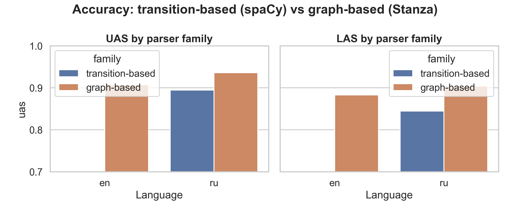
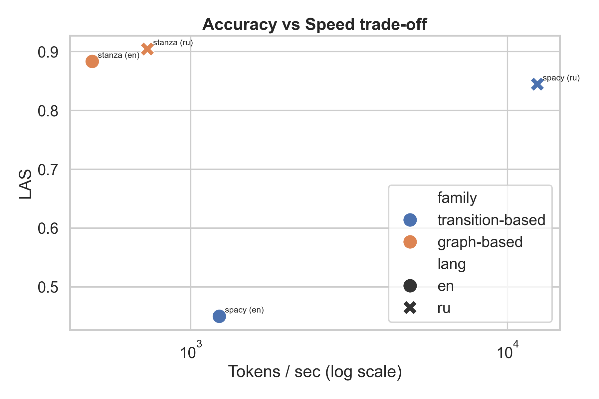
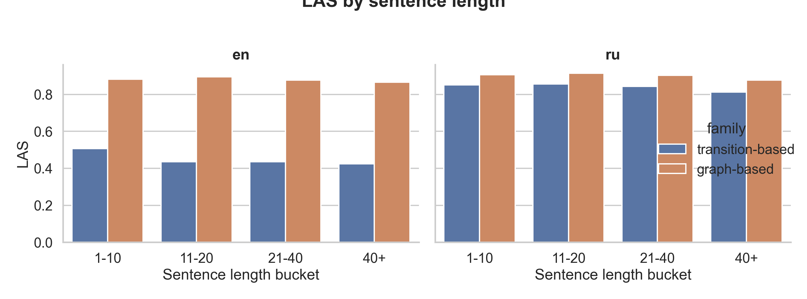
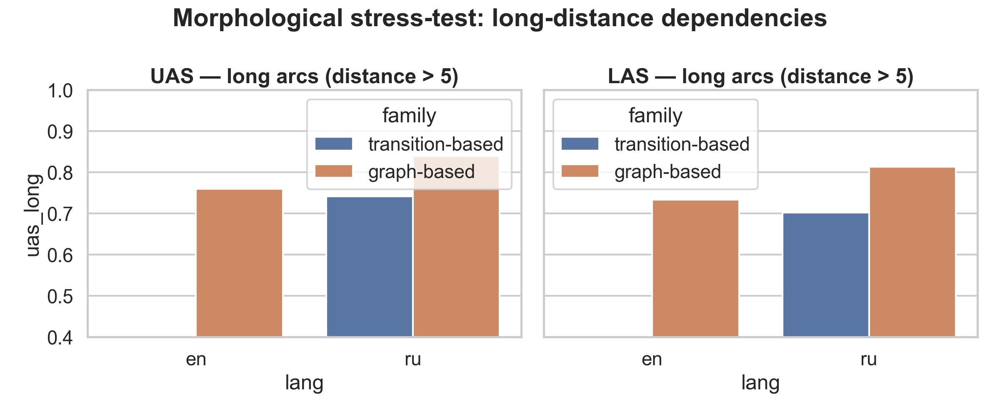
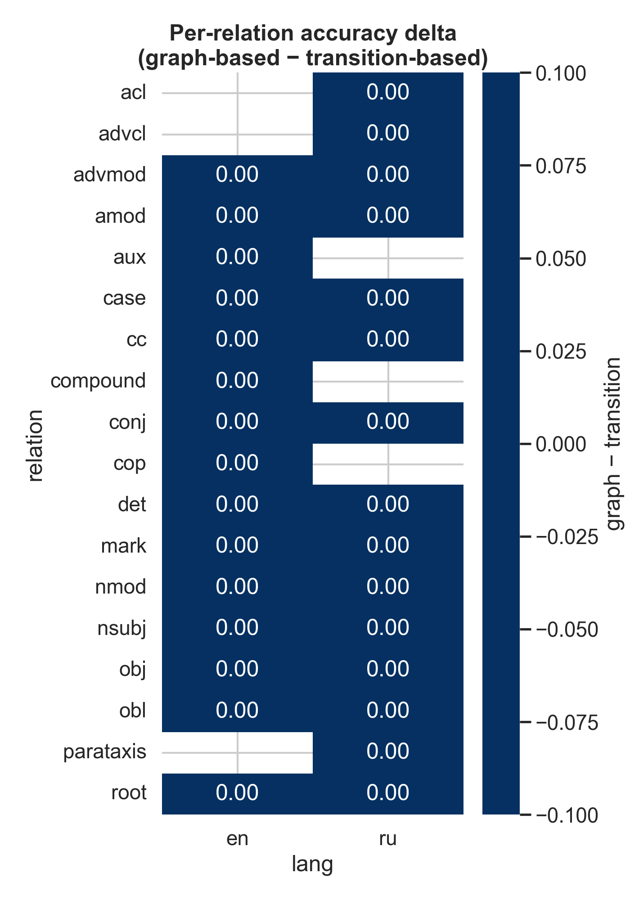
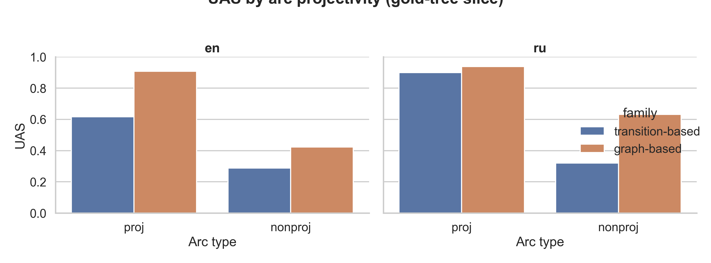
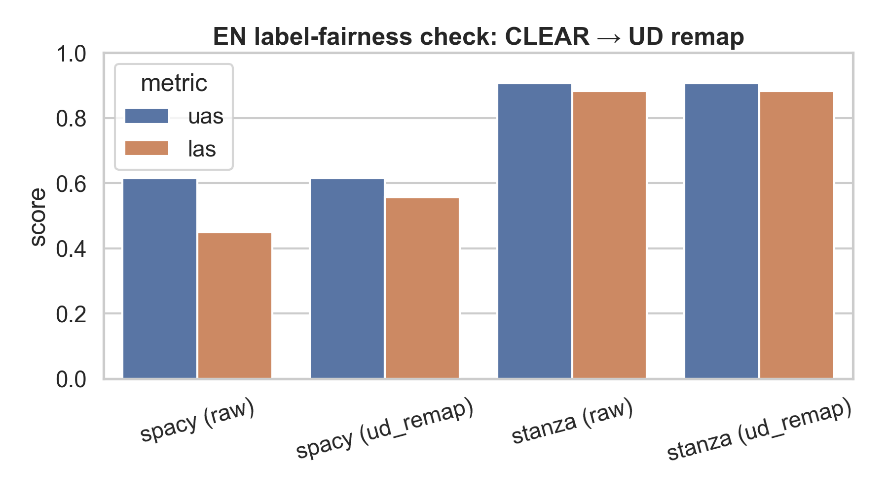

# Transition-Based vs Graph-Based Dependency Parsers
### A practical trade-off study on English and Russian
**Aleksandr Gavkovskii — NLP 2026, Case Study 5.5 — Innopolis University**

---

## Motivation

Dependency parsers split into two algorithmic families with opposite design trade-offs:
- **Transition-based** (shift-reduce, arc-eager): greedy local decisions, linear time, risk of error cascades
- **Graph-based** (biaffine + MST decoding): global optimization over all possible trees, quadratic time, structurally consistent

**Questions:**
1. How large is the practical speed/accuracy trade-off in production-grade implementations?
2. Does morphological richness and free word order (Russian) amplify the gap?
3. Where, structurally, does the graph-based family earn its wins?

---

## Methodology

| | spaCy | Stanza |
|---|---|---|
| **Family** | Transition-based | Graph-based |
| **Architecture** | shift-reduce (arc-eager) | biaffine attention + MST decoding |
| **EN model** | `en_core_web_trf` (RoBERTa) | `en` pipeline |
| **RU model** | `ru_core_news_lg` | `ru` pipeline |

**Data:** Universal Dependencies 2.13 test splits
- English: UD English-EWT — 2,077 sentences
- Russian: UD Russian-SynTagRus — 8,800 sentences

**Evaluation:** gold tokenization for fair comparison, UAS + LAS (punctuation excluded), tokens/sec on CPU (3 repeats + warmup), peak memory via `tracemalloc`.

**Caveat — EN LAS:** `en_core_web_trf` emits CLEAR-style labels (`dobj`, `pobj`, `prep`) rather than pure UD (`obj`, `obl`, `case`). This depresses its EN LAS by construction. We report UAS as the label-scheme-neutral accuracy metric and treat the LAS gap on EN as an **upper bound** rather than a fair attack.

---

## Core Results

| Parser | Lang | UAS | LAS | Tok/sec | Peak mem |
|---|---|---|---|---|---|
| spaCy (transition)  | EN | 0.615 | 0.450\* | 1,231 | 25.3 MB |
| Stanza (graph)      | EN | **0.907** | **0.883** |   488 | **13.6 MB** |
| spaCy (transition)  | RU | 0.895 | 0.845 | **12,435** | 70.9 MB |
| Stanza (graph)      | RU | **0.936** | **0.904** |   729 | **9.3 MB** |

\*EN LAS for spaCy reflects label-scheme mismatch with UD, not pure attachment error — see caveat.

*Figure 1. UAS and LAS by parser family on EN-EWT and RU-SynTagRus. The EN LAS bar for spaCy is depressed by label-scheme mismatch (see caveat above).*

*Figure 2. LAS vs tokens/sec (log scale). Transition-based (spaCy) sits top-right on RU — high throughput, acceptable accuracy. Graph-based (Stanza) dominates the accuracy axis on both languages.*

- **Speed:** transition-based is 2.5× faster on EN (transformer backbone) and **17× faster on RU** (lg CNN backbone).
- **Memory:** graph-based uses ~2× *less* peak memory in both languages — at the cost of throughput.
- **Accuracy (UAS):** Stanza leads everywhere; gap is **+29 pts on EN** (inflated by the LAS-label issue propagating into attachment choices) and **+4.1 pts on RU** on a fair UD head-to-head.

---

## Where Each Family Wins

### Sentence length

*Figure 3. LAS by bucket (1–10, 11–20, 21–40, 40+ tokens). Both parsers degrade on long sentences; the graph-based gap widens slightly on RU 40+.*

Stanza degrades gracefully; spaCy is flatter only because it starts much lower.
**RU, UAS 1–10 → 40+:** Stanza 0.941 → 0.913 (−2.8 pt); spaCy 0.904 → 0.865 (−3.9 pt). The gap **widens from 3.7 pt to 4.9 pt** as sentences grow — consistent with greedy decisions accumulating more errors on long inputs.

### Long-distance arcs (head–dependent distance > 5)

*Figure 4. Accuracy restricted to arcs where |head − dependent| > 5 tokens. The graph–transition gap is largest here, especially on EN (+37 pt UAS), and more than doubles on RU (9.8 pt vs 4.1 pt aggregate).*

| | EN UAS on long arcs | RU UAS on long arcs |
|---|---|---|
| spaCy (transition) | 0.388 | 0.742 |
| Stanza (graph) | **0.760** | **0.840** |
| Δ (graph − transition) | **+37.2 pt** | **+9.8 pt** |

This is the largest structural gap in the study. Long, often non-projective arcs are exactly the case where MST decoding pays off and greedy shift-reduce pays its error-cascade cost.
**On RU the long-arc delta (9.8 pt) is more than 2× the overall delta (4.1 pt)** — the aggregate number under-states how much graph-based actually helps on hard dependencies.

### Per-relation delta

*Figure 5. (graph − transition) per-relation accuracy delta, top-15 most frequent UD relations per language. Red = graph-based better. The RU column isolates the fair comparison; note spaCy's `xcomp` / `iobj` wins as blue cells.*

### Projectivity slice — the cleanest structural signal

*Figure 6. UAS split by arc projectivity (gold-tree classification). Non-projective arcs are the theoretical weak spot of shift-reduce.*

| | Projective arcs | Non-projective arcs |
|---|---|---|
| **EN** spaCy / Stanza UAS | 0.616 / 0.908 (Δ +29 pt) | 0.289 / 0.422 (Δ +13 pt) — only 45 NP arcs (0.2%) |
| **RU** spaCy / Stanza UAS | 0.899 / 0.938 (Δ +3.9 pt) | 0.321 / 0.632 (Δ **+31 pt**) — 1,079 NP arcs (0.85%) |

On Russian non-projective arcs, graph-based UAS is **nearly 2× that of transition-based** — the largest structural gap in the whole study, and a direct empirical confirmation of the shift-reduce weak spot. Both parsers still struggle with NP arcs in absolute terms (Stanza hits only 0.63 UAS), so this is an open problem, not a solved one.

### EN label-fairness check — how much of the EN LAS gap is labels vs attachment?

*Figure 7. spaCy EN LAS raw vs after CLEAR→UD label remap (`src/label_map.py`). Stanza already uses UD so remap is a no-op.*

| | UAS | LAS (raw) | LAS (UD-remap) |
|---|---|---|---|
| spaCy EN | 0.615 | 0.450 | **0.557** (+10.6 pt from labels) |
| Stanza EN | 0.907 | 0.883 | 0.883 |
| Remaining LAS gap | | 43.3 pt | **32.6 pt** |

Label remapping closes ~1/4 of the raw LAS gap; the remaining ~32 pt matches the UAS gap (29 pt) — i.e. once labels are fair, **the EN gap is genuine attachment error, not a scoring artefact**. This validates the decision to report UAS as the primary EN metric in earlier sections. Remap is label-only — it cannot fix the CLEAR preposition-chain structure (`prep → pobj` vs UD `case + obl/nmod`), so even this number is a lower bound on spaCy EN's "true" fairness-corrected LAS.

**Russian (fair UD-vs-UD):** Stanza's biggest wins are on `compound` (+65 pt), `vocative` (+59 pt), `expl` (+67 pt), `flat` (+19 pt), `obl` (+16 pt), `parataxis` (+24 pt) — relations that span long distances, violate projectivity, or require global tree consistency. spaCy wins on a small set — notably `xcomp` (+6.9 pt) and `iobj` (+4.0 pt) — short-range, lexically-cued relations where local features suffice.

**Top RU confusions** (from [confusion_top.csv](../results/confusion_top.csv)) confirm the mechanism: spaCy's dominant error is mis-routing oblique arguments (`obl → advmod`, `obl → nmod`, `obl → obj`) — head-selection mistakes that propagate through the greedy stack.

---

## Conclusions

1. **Speed/Memory is not a tie.** Transition-based (spaCy) wins throughput decisively — **17× on RU, 2.5× on EN** — but *uses more* peak memory, because the CNN/transformer tagger dominates, not the parser. If you only care about throughput, the choice is obvious.
2. **Accuracy gap is real but narrower than folklore on RU overall.** Once label-scheme artefacts are controlled for (Figure 7), graph-based leads RU UAS by ~4 pt overall — meaningful, not dramatic.
3. **The gap concentrates where theory predicts, and it is dramatic there.** The aggregate RU +4 pt hides a **+31 pt gap on non-projective arcs** (Figure 6) and a **+9.8 pt gap on long arcs** (Figure 4). These are the regimes where greedy shift-reduce structurally cannot recover — global MST decoding is doing real work, not just scoring noise.
4. **The EN gap is genuine attachment error, not label bias.** CLEAR→UD remap closes 11 pt of the 43 pt raw LAS gap; the residual 32 pt matches the UAS gap one-for-one. Label-scheme is a caveat, not an excuse.
5. **Morphological richness alone does not flip the verdict.** Russian is where you'd expect graph-based to dominate; it does, but the effect is concentrated on *long-distance* and *non-projective* constructions — structural properties of free word order — not on morphology per se.
6. **Practical recipe:**
   - **High-volume, real-time, short text (chat, logs, search):** transition-based. The throughput is worth the 4-point UAS trade on RU.
   - **Offline analysis, long documents, legal / literary Russian, linguistic research:** graph-based. The non-projective-arc gap (Figure 6) is structural, not incidental — if your data contains free-word-order discontinuities, shift-reduce will quietly mis-route them.
   - **Picking a label scheme matters.** If you need UD-conformant output, check label coverage before trusting an out-of-the-box LAS number — or apply an explicit remap (`src/label_map.py`) and publish both variants.

---

*Figures: [poster/fig_*.png](.) | Code: [notebooks/](../notebooks/) | Results: [results/](../results/) | Data: UD 2.13*
